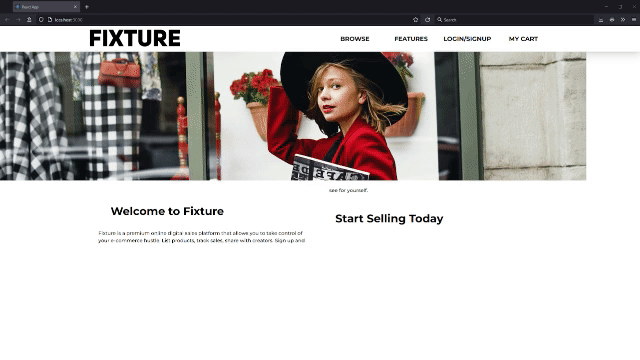

# Fixture

[](https://opensource.org/licenses/MIT)

## Description

Fixture is a premium online digital sales platform that allows you to take control of your e-commerce hustle. List products, track sales, share with creators. Sign up and see for yourself!

Fixture is written in HTML, CSS, JavaScript, and JSX, utilizing Node.js, Express.js, and MongoDB for the backend server. The frontend is a React application. Packages used include Apollo Server Express, JSON Web Token for authentication and authorization, Mongoose for the database ODM, AWS SDK, bcrypt, GraphQL, and Stripe. The application is deployed to Heroku with MongDB Atlas for database services.



## Table of Contents
- [Link to Deployed Application](#link-to-deployed-application)
- [User Story](#user-story)
- [Installation](#installation)
- [Usage](#usage)
- [Tests](#tests)
- [Authors](#authors)
- [License](#license)
- [Contributing](#contributing)
- [Questions](#questions)

## Link to Deployed Application

[https://peaceful-fjord-92696.herokuapp.com/](https://peaceful-fjord-92696.herokuapp.com/)

## User Story

This e-commerce web app was created to meet the requirements of the following user story:

```
AS A merchant of the web
I WANT a centralized marketplace
SO THAT I can buy & sell digital goods
```

## Installation

If you would like to run Fixture locally instead of visiting the deployed application, follow these steps:

1. Clone the repository, or download and extract an archive of it
2. Run `npm install` to obtain the required dependencies
3. Run a local instance of MongoDB for the server to connect to

## Usage

1. Invoke the app in development mode with the command `npm run develop`
2. Visit [http://localhost:3000/](http://localhost:3000/) to begin browsing Fixture

## Tests

There is no test suite included with this application.

## Authors

- Caleb Luster ([https://github.com/CalebLuster](https://github.com/CalebLuster))
- Daniel Birmingham ([https://github.com/Prolix19](https://github.com/Prolix19))
- Dominic Misasi ([https://github.com/Meshtatsuo](https://github.com/Meshtatsuo))
- Kate Stensing ([https://github.com/kstensing](https://github.com/kstensing))
- Stephanie Anderson ([https://github.com/git6548](https://github.com/git6548))

## License

[](https://choosealicense.com/licenses/mit/)

## Contributing

This project is not open to contributions at this time.

## Questions

Please contact the authoring team via GitHub with any additional questions you may have.
